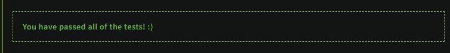

## Как выполнять?
1. Регистрируемся на площадке (www.codewars.com)
2. Открываем задачу по ссылке
3. Решаем
4. Запускаем своё решение на платформе и ждём заветную строку

5. Копируем своё решение в файл внутри нашего репозитория
6. Жмём кнопку submit
7. Повторяем так со всеми задачами
8. Отправляем решение в удаленный репозиторий
9. Вы великолепны!

### Task 1

Написать решение задачи
https://www.codewars.com/kata/5c374b346a5d0f77af500a5a

### Task 2

https://www.codewars.com/kata/5c8bfa44b9d1192e1ebd3d15

### Task 3

https://www.codewars.com/kata/54da5a58ea159efa38000836